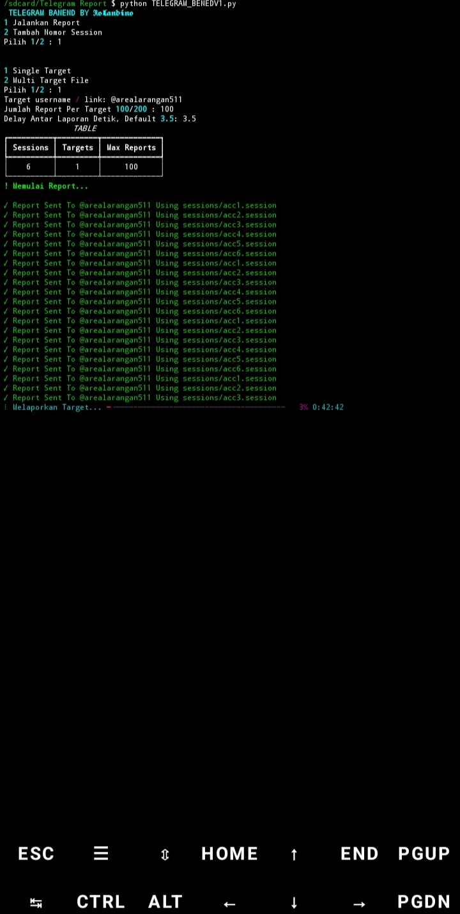

# TELEGRAM REPORT
Auto Report Telegram (User / Group / Channel) Dengan Multi Session Dan Rotasi Otomatis

---



---

## DOWNLOAD SCRIPT

```bash
https://safelinku.com/XXXXX
```
---

## Fitur
- Multi Session Telegram (acc1, acc2, acc3)
- Rotasi Akun Otomatis
- Random Report Reason (Spam, Fake, Violence, Porn, Child Abuse)
- Support Single Target / Mass Target Via file .txt
- Progress Bar Dan Log Real Time
- Auto Skip Session Rusak / 2FA
- Delay Custom

---

## Medule Wajib

```bash
pip install telethon rich
```
---

## Cara Menjalankan
[](https://youtu.be/VzC8c_zNCmk?si=pb7yLjiGIDXRtw0p)

---

## Peringatan 

Tools Dibuat Untuk Edukasi Dan Riset
Segala Penyalahgunaan Ditanggung Pengguna Masing Masing!

---

